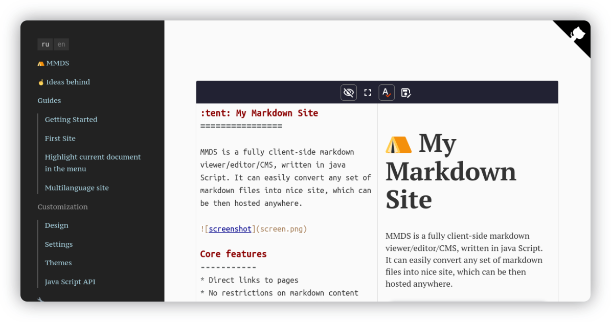

:ru: [Русский](https://girobusan.github.io/mmds/#!index.ru.md)

:tent: My Markdown Site
=======================

100% client-side markdown CMS/viewer/editor written in Java Script. Current version is still experimental (but mostly works), but we're close to something useful. [See demo site](https://girobusan.github.io/mmds/#!index.en.md).

The purpose of it is to publish any set of markdown documents on any server in no time,
be able to quickly edit them in place, and be able to easily use the same markdown files anywhere else. 

## Use cases

* Documentation
* Sites for limited term projects
* Sites for learning courses (when site is started with the course, than filled as the course go, and finally closed, converted to pdf and handed to students)
* [ Neocities ](https://neocities.org/)
* Quick publication of notes from markdown note-taking apps like Obsidian or Joplin.

### Comparison with alternative approaches

The main alternatives are either server-side Content Management System (CMS) or Static Site Generator (SSG) like Jekill. Others are online services, like Notion. 

- __SSG:__ resulting site may be static and more accessible (MMDS requires Java Script in browser), but you have to regenerate site after any edits or setup the automated workflow. Usually does not include markdown editor.
- __CMS:__ more accessible site, usually includes editor and full-blown backend, but requires server setup and your need to perform additional task to get your text as separate files for use somewhere outside the CMS.
- __Online services:__ a lot of useful functions, but your files are kept on they
servers, when MMDS can work locally on your computer without Internet access. And it is not that easy to ban you from your own computer, you know.

Therefore, if you do not mind dependency on Java Script, MMDS do have some advantages here: ability to edit files in place, no special requirements on 
server software or source files and almost no setup. 

### Comparison with other projects of the same kind 

* [CMS.js](https://github.com/chrisdiana/cms.js): CMS, which works entirely in browser
* [IMP!](https://github.com/girobusan/imp): my other project, single page CMS
* [MDWiki](https://github.com/Dynalon/mdwiki): client-side wiki-like web app
 
|  :wrench:             | CMS.js             | MDWiki             | MMDS              | IMP!                | 
|-----------------------|--------------------|--------------------|-------------------|---------------------|
| Multi page site       | yes :+1:         | yes :+1:         | yes :+1:        |  no :thumbsdown:   |
| Requires JS to view   | yes :thumbsdown: | yes :thumbsdown: | yes :thumbsdown:|  no :+1:          |
| URLs for pages        | yes  :+1:        | yes :+1:         | yes :+1:        |  inapplicable*      |
| Editor                | no :thumbsdown:  | no  :thumbsdown: | yes :+1:        |  yes :+1:         |
| Requires server setup | yes :thumbsdown: | no :+1:          | no :+1:         |  no :+1:          |
| Automatic lists       | yes :+1:         | no  :thumbsdown: | no :thumbsdown: |  inapplicable*      | 
| Custom design         |themes and templates| CSS                | full control      |  full control       |
| Custom functions      | :question:         | Plugins            | User scripts      |  Any scripts        |
| Project status        | mature             | dead               | just started      |  pretty mature      |

\* IMP! is CMS/Editor/Viewer for **single** page.

## Features

* Direct links to pages
* No restrictions on markdown content 
* Renders HTML inside markdown
* Totally customizable design (html + css + JS API for custom scripts)
* Embedded markdown editor 
* ...and, of course, you can use ANY markdown editor.
* Any server (no server setup required)

## License

- MIT

## Based on

- CodeJar
- Preact
- Markdown-it
- Prism
- ...

