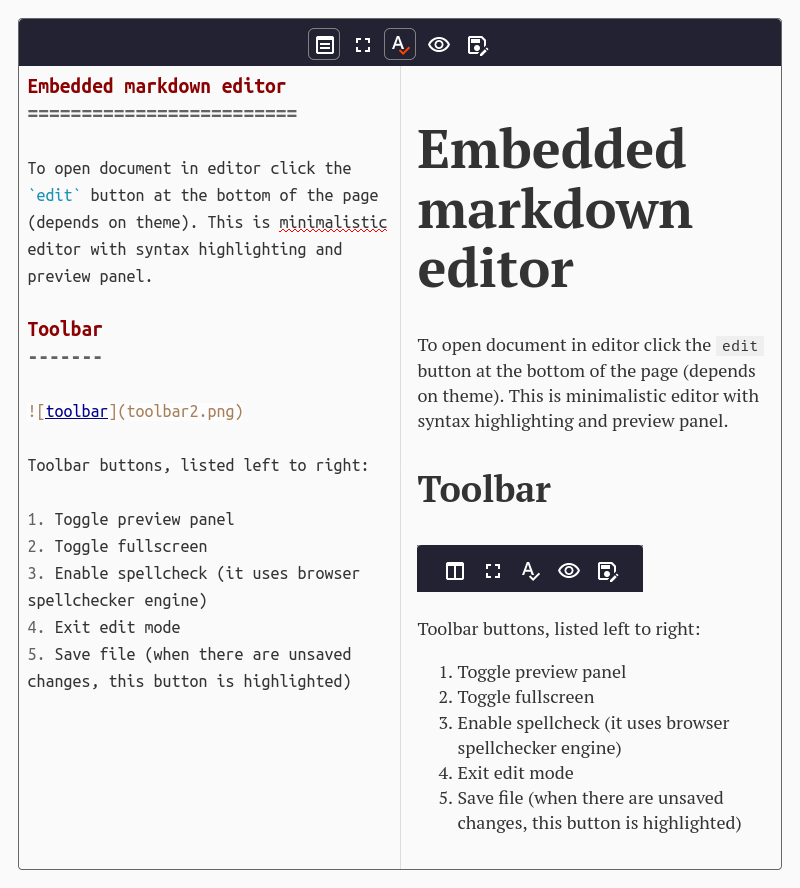

Embedded markdown editor
=========================

To open document in editor click the `edit` button at the bottom of the page (depends on theme). This is minimalistic editor with syntax highlighting and preview panel (preview panel may not be opened by default).

Toolbar
-------

  

Toolbar buttons, listed left to right:

1. Toggle preview panel
2. Toggle fullscreen
3. Enable spellcheck (it uses browser spellchecker engine)
4. Exit edit mode
5. Save file (when there are unsaved changes, this button is highlighted) 