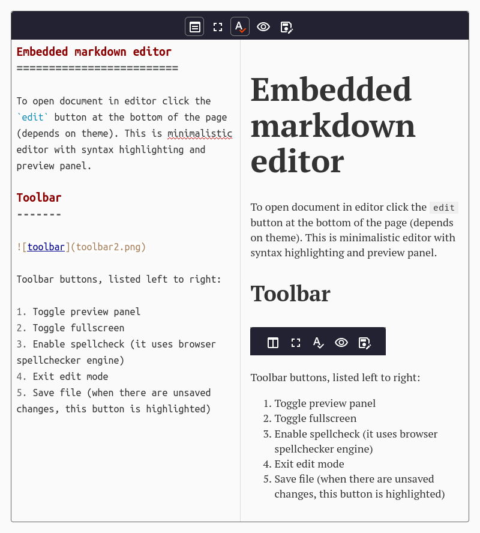
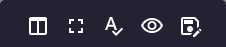

Встроенный редактор
=================== 
Для перехода в режим редактирования нужно нажать кнопку `edit` в нижней части страницы (зависит от темы). Документ откроется в минималистичном редакторе с подсветкой синтаксиса и панелью предварительного просмотра (панель предварительного просмотра может быть не показана по умолчанию).

Панель инструментов
------
 

Кнопки, слева направо:

1. Переключить предварительный просмотр.
1. Переключить полноэкранный режим.
1. Проверка орфографии (используется встроенный в браузер движок)
1. Вернуться в режим просмотра
1. Сохранить файл. Эта кнопка подсвечивается оранжевым, если в документе есть несохраненные изменения. 